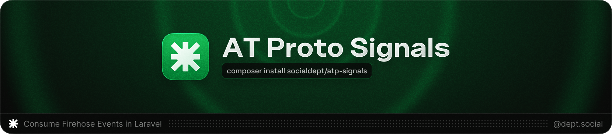

[](https://github.com/socialdept/atp-signals)

<h3 align="center">
    Consume real-time AT Protocol events in your Laravel application.
</h3>

<p align="center">
    <br>
    <a href="https://packagist.org/packages/socialdept/atp-signals" title="Latest Version on Packagist"></a>
    <a href="https://packagist.org/packages/socialdept/atp-signals" title="Total Downloads"></a>
    <a href="https://github.com/socialdept/atp-signals/actions/workflows/tests.yml" title="GitHub Tests Action Status"></a>
    <a href="LICENSE" title="Software License"></a>
</p>

---

## What is Signal?

**Signal** is a Laravel package that lets you respond to real-time events from the AT Protocol network. Build reactive applications, custom feeds, moderation tools, analytics systems, and AppViews by listening to posts, likes, follows, and other social interactions as they happen across Bluesky and the entire AT Protocol ecosystem.

Think of it as Laravel's event listeners, but for the decentralized social web.

## Why use Signal?

- **Laravel-style code** - Familiar patterns you already know
- **Real-time processing** - React to events as they happen
- **Dual-mode support** - Choose Jetstream (efficient JSON) or Firehose (comprehensive CBOR)
- **AppView ready** - Full support for custom collections and protocols
- **Production features** - Queue integration, cursor management, auto-reconnection
- **Easy filtering** - Target specific collections, operations, and users with wildcards
- **Built-in testing** - Test your signals with sample data

## Quick Example

```php
use SocialDept\AtpSignals\Events\SignalEvent;
use SocialDept\AtpSignals\Signals\Signal;

class NewPostSignal extends Signal
{
    public function eventTypes(): array
    {
        return ['commit'];
    }

    public function collections(): ?array
    {
        return ['app.bsky.feed.post'];
    }

    public function handle(SignalEvent $event): void
    {
        $record = $event->getRecord();

        logger()->info('New post created', [
            'did' => $event->did,
            'text' => $record->text ?? null,
        ]);
    }
}
```

Run `php artisan signal:consume` and start responding to every post on Bluesky in real-time.

## Installation

```bash
composer require socialdept/atp-signals
php artisan signal:install
```

That's it. [Read the installation docs →](docs/installation.md)

## Getting Started

Once installed, you're three steps away from consuming AT Protocol events:

### 1. Create a Signal

```bash
php artisan make:signal NewPostSignal
```

### 2. Define What to Listen For

```php
public function collections(): ?array
{
    return ['app.bsky.feed.post'];
}
```

### 3. Start Consuming

```bash
php artisan signal:consume
```

Your Signal will now handle every matching event from the network. [Read the quickstart guide →](docs/quickstart.md)

## What can you build?

- **Custom feeds** - Curate content based on your own algorithms
- **Moderation tools** - Detect and flag problematic content automatically
- **Analytics platforms** - Track engagement, trends, and network growth
- **Social integrations** - Mirror content to other platforms in real-time
- **Notification systems** - Alert users about relevant activity
- **AppViews** - Build custom AT Protocol applications with your own collections

## Documentation

**Getting Started**
- [Installation](docs/installation.md) - Detailed setup instructions
- [Quickstart Guide](docs/quickstart.md) - Build your first Signal
- [Jetstream vs Firehose](docs/modes.md) - Choose the right mode

**Building Signals**
- [Creating Signals](docs/signals.md) - Complete Signal reference
- [Filtering Events](docs/filtering.md) - Target specific collections and operations
- [Queue Integration](docs/queues.md) - Process events asynchronously

**Advanced**
- [Configuration](docs/configuration.md) - All config options explained
- [Testing](docs/testing.md) - Test your Signals
- [Examples](docs/examples.md) - Real-world use cases

## Example Use Cases

### Track User Growth
```php
public function collections(): ?array
{
    return ['app.bsky.graph.follow'];
}
```

### Monitor Content Moderation
```php
public function collections(): ?array
{
    return ['app.bsky.feed.*'];
}

public function shouldQueue(): bool
{
    return true; // Process in background
}
```

### Build Custom Collections (AppView)
```php
public function collections(): ?array
{
    return ['app.yourapp.custom.collection'];
}
```

[See more examples →](docs/examples.md)

## Key Features Explained

### Jetstream vs Firehose

Signal supports two modes for consuming AT Protocol events:

- **Jetstream** (default) - Simplified JSON events with server-side filtering
- **Firehose** - Raw CBOR/CAR format with client-side filtering

[Learn more about modes →](docs/modes.md)

### Wildcard Filtering

Match multiple collections with patterns:

```php
public function collections(): ?array
{
    return [
        'app.bsky.feed.*',      // All feed events
        'app.bsky.graph.*',     // All graph events
        'app.yourapp.*',        // All your custom collections
    ];
}
```

[Learn more about filtering →](docs/filtering.md)

### Queue Integration

Process events asynchronously for better performance:

```php
public function shouldQueue(): bool
{
    return true;
}
```

[Learn more about queues →](docs/queues.md)

## Available Commands

```bash
# Install Signal
php artisan signal:install

# Create a new Signal
php artisan make:signal YourSignal

# List all registered Signals
php artisan signal:list

# Start consuming events
php artisan signal:consume

# Test a Signal with sample data
php artisan signal:test YourSignal
```

## Requirements

- PHP 8.2+
- Laravel 11+
- WebSocket support (enabled by default)

## Resources

- [AT Protocol Documentation](https://atproto.com/)
- [Bluesky API Docs](https://docs.bsky.app/)
- [Firehose Documentation](https://docs.bsky.app/docs/advanced-guides/firehose)
- [Jetstream Documentation](https://github.com/bluesky-social/jetstream)

## Support & Contributing

Found a bug or have a feature request? [Open an issue](https://github.com/socialdept/atp-signals/issues).

Want to contribute? We'd love your help! Check out the [contribution guidelines](CONTRIBUTING.md).

## Credits

- [Miguel Batres](https://batres.co) - founder & lead maintainer
- [All contributors](https://github.com/socialdept/atp-signals/graphs/contributors)

## License

Signal is open-source software licensed under the [MIT license](LICENSE).

---

**Built for the Atmosphere** • By Social Dept.
